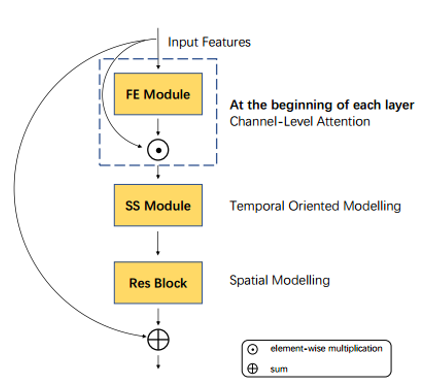

# FEXNet: Foreground Extraction Network for Human Action Recognition
## Overview
We release the PyTorch code of [FEXNet](https://ieeexplore.ieee.org/abstract/document/9509412). 



The code is majorly based on [TSM](https://github.com/mit-han-lab/temporal-shift-module). The global structure of FEXNet is shown in the figure above. The proposed **Foreground EXtraction** blocks contains **Scene Segregation** and **Foreground Enhancement** modules to extract foreground features in different aspects as below.

Detailed structure of **SS Module**:


Detailed structure of **FE Module**:


The detailed data pre-processing and preperation strategies follow the settings of [TSM](https://github.com/mit-han-lab/temporal-shift-module).

## Prerequisites
The code is built with following libraries:

- [PyTorch](https://pytorch.org/) 1.5.0 or higher
- [TensorboardX](https://github.com/lanpa/tensorboardX)
- [tqdm](https://github.com/tqdm/tqdm.git)
- [scikit-learn](https://scikit-learn.org/stable/)

## Training & Testing
The configuration of the super parameters also follows [TSM](https://github.com/mit-han-lab/temporal-shift-module).

Please refer to ```Training.sh``` and ```Testing.sh``` provided in the project for the detailed configuration.

## Citation
```
@article{shen2021fexnet,
  title={FEXNet: Foreground Extraction Network for Human Action Recognition},
  author={Shen, Zhongwei and Wu, Xiao-Jun and Xu, Tianyang},
  journal={IEEE Transactions on Circuits and Systems for Video Technology},
  year={2021},
  publisher={IEEE}
}
```
